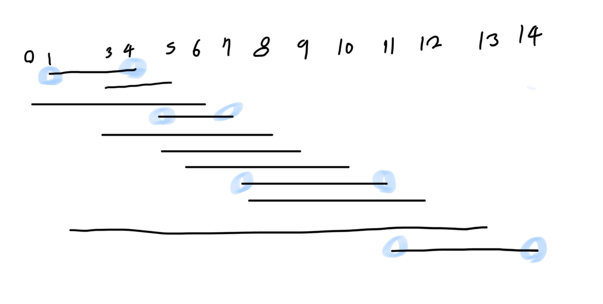

[문제링크](https://www.acmicpc.net/problem/1931)

## 접근 방향 설명
정렬 문제인 만큼! 보자마자 어떤 식으로 정렬을 해야 할까에 집중했다. 


이번 문제를 도식화하여 나타내니, 방향이 잘 보였다. 
그림과 같이 끝나는 시간을 우선으로 고려하여 정렬하고, 그 뒤로 올 수 있는 시작시간을 가진 회의를 헤아리면 되는 문제였다! 

여기까지는 그림을 통해 쉽게 알아낼 수 있었던 부분이지만, 문제를 꼼꼼히 읽어보면 조건이 하나 더 있었는데 `. 회의의 시작시간과 끝나는 시간이 같을 수도 있다. 이 경우에는 시작하자마자 끝나는 것으로 생각하면 된다.` 를 염두에 뒀어야 했다. 

```
3
4 4
3 4
2 4
```

위 조건을 캐치하지 못한 경우, 예시 입력의 출력은 1 이 된다. (정답: 2)
그렇기 때문에, **정렬 과정에서 끝나는 시간이 같은 경우,** 시작 시간을 기준으로 다시 정렬해줘야 한다. 


--- 

## 풀이 코드 해석
``` java script
const fs = require("fs");
const filePath = process.platform === "linux" ? "/dev/stdin" : "/input.txt";
let input = fs.readFileSync(__dirname + filePath).toString().split("\n");

const meeting_num = input[0];
const meetings = input.slice(1);
let answer = 0;

meetings.sort(compare)

// console.log(meetings)
let prev_end = 0;
meetings.forEach((meeting) =>{
    // console.log(prev_end)
    const m = meeting.split(" ").map(Number);
    if(m[0] >= prev_end ) {
        answer++;
        // console.log(m) 
        prev_end = m[1];
    }
})

console.log(answer)

function compare (a,b) { // 정렬의 기준은 끝나는 시간_ 오름차순
    let num1 = a.split(' ');
    let num2 = b.split(' ');
    if (num1[1] == num2[1]) return num1[0] - num2[0] // 끝나는 시간이 같을 경우 + 시작시간과 끝나는 시간이 같을 경우!!! 
    return num1[1] - num2[1];
}

```
---

## 풀이 과정에서 새롭게 느낀점(배운점)
**도식화 꼭!! 하기 ✍🏻**
제한된 시간을 주고 알고리즘 문제를 풀게 하는 코딩테스트의 특성상, **짧은 시간 안에 문제해결 능력**을 보여줘야 하기 때문에 걸음마 단계인 나로선 우선 겉멋 부리지 말고!!! 여러가지 생각해보고 손으로 쓰면서 감각을 익히자! 

<문제 풀면서 중간중간 생각할 것>
1) 문제를 얼마나 잘 이해했는지 
2) 문제해결을 위한 코드를 얼마나 잘 옮겨서 쓸 수 있는지
3) 더 생각해야할 조건이나 예외상황 떠올리기

---
## 문제

한 개의 회의실이 있는데 이를 사용하고자 하는 N개의 회의에 대하여 회의실 사용표를 만들려고 한다. 각 회의 I에 대해 시작시간과 끝나는 시간이 주어져 있고, 각 회의가 겹치지 않게 하면서 회의실을 사용할 수 있는 회의의 최대 개수를 찾아보자. 단, 회의는 한번 시작하면 중간에 중단될 수 없으며 한 회의가 끝나는 것과 동시에 다음 회의가 시작될 수 있다. 회의의 시작시간과 끝나는 시간이 같을 수도 있다. 이 경우에는 시작하자마자 끝나는 것으로 생각하면 된다.

----

**입력**
첫째 줄에 회의의 수 N(1 ≤ N ≤ 100,000)이 주어진다. 둘째 줄부터 N+1 줄까지 각 회의의 정보가 주어지는데 이것은 공백을 사이에 두고 회의의 시작시간과 끝나는 시간이 주어진다. 시작 시간과 끝나는 시간은 231-1보다 작거나 같은 자연수 또는 0이다.

**출력**
첫째 줄에 최대 사용할 수 있는 회의의 최대 개수를 출력한다.