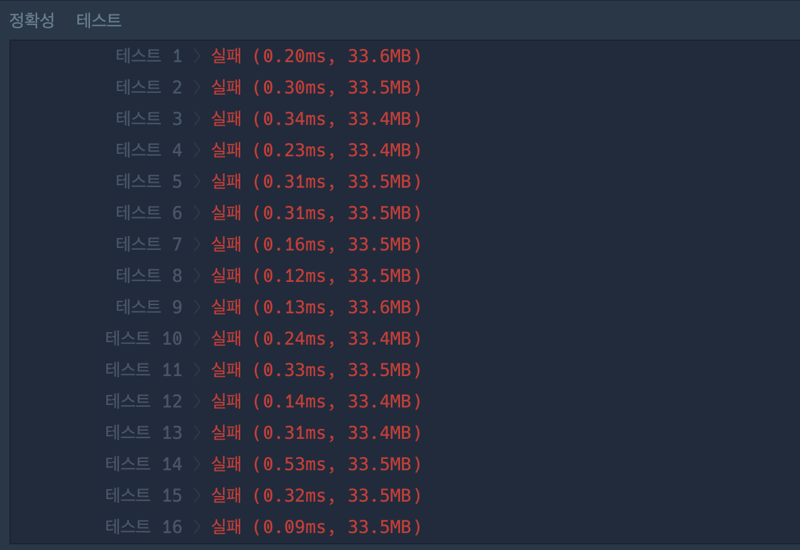

[문제링크](https://school.programmers.co.kr/learn/courses/30/lessons/42747)

## 접근 방향 설명
1) 주어진 배열의 길이가 h_idx의 최댓값이 될 수 있으므로, h_idx == c.length [3,3,3] => 3 
2) h_idx를 기준으로, 해당 숫자 이상 인용된 논문의 수를 구한다.
3) c_count >= h_idx 이면, return / 
아니라면 h_idx-- 로 반복  

--- 

## 풀이 코드 해석
``` java script
function solution(c) {
    const sort_arr = c.sort((a,b) => a-b); // 오름차순 정렬 
    let h_idx = c.length; // h_index가 될 수 있는 최대  / [3,3,3] => 3 

    
    while (h_idx > 0 ) { 
        let up_to_hIdx =  sort_arr.filter((e) => e >= h_idx); // h_index 이상의 배열
        let c_count = up_to_hIdx.length; //h_idx 이상 인용된 논문수
        if(c_count >= h_idx ) break; // 인용수 충족시 break
        h_idx--; // else h_idx 값 줄이기
    }
    return h_idx;
}
```
---

## 풀이 과정에서 새롭게 느낀점(배운점)


1) 금방 테케를 해결해서 내심 기분이 좋았으나... 채점하니 시뻘겋게 나오는 화면을 보고 
..? 🤨 당황했다. 끙끙거리면서 해결보려고 했으나, 설명과 주어진 예시에 틀린게 없어서 한참 고민하다가 시간을 좀 썼던거 같다. 

결론: 테케의 종류가 부족한 경우, 질문게시판에서 추가로 테스트 케이스 따와서 다시 생각하자! 
(효율적으로 생각하자!)

---

## 문제
H-Index는 과학자의 생산성과 영향력을 나타내는 지표입니다. 어느 과학자의 H-Index를 나타내는 값인 h를 구하려고 합니다. 위키백과1에 따르면, H-Index는 다음과 같이 구합니다.

어떤 과학자가 발표한 논문 n편 중, h번 이상 인용된 논문이 h편 이상이고 나머지 논문이 h번 이하 인용되었다면 h의 최댓값이 이 과학자의 H-Index입니다.

어떤 과학자가 발표한 논문의 인용 횟수를 담은 배열 citations가 매개변수로 주어질 때, 이 과학자의 H-Index를 return 하도록 solution 함수를 작성해주세요.

**제한사항** 
과학자가 발표한 논문의 수는 1편 이상 1,000편 이하입니다.
논문별 인용 횟수는 0회 이상 10,000회 이하입니다.

**입출력 예**
citations	return
[3, 0, 6, 1, 5]	3

**입출력 예 설명**
이 과학자가 발표한 논문의 수는 5편이고, 그중 3편의 논문은 3회 이상 인용되었습니다. 그리고 나머지 2편의 논문은 3회 이하 인용되었기 때문에 이 과학자의 H-Index는 3입니다. 


